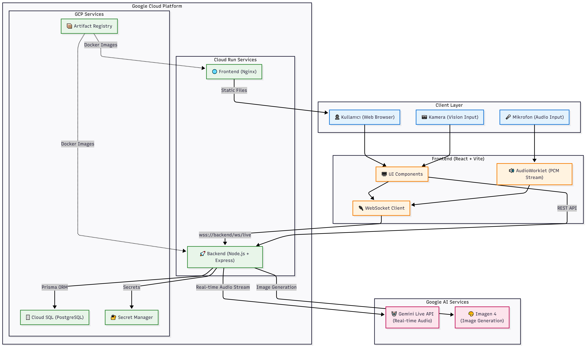
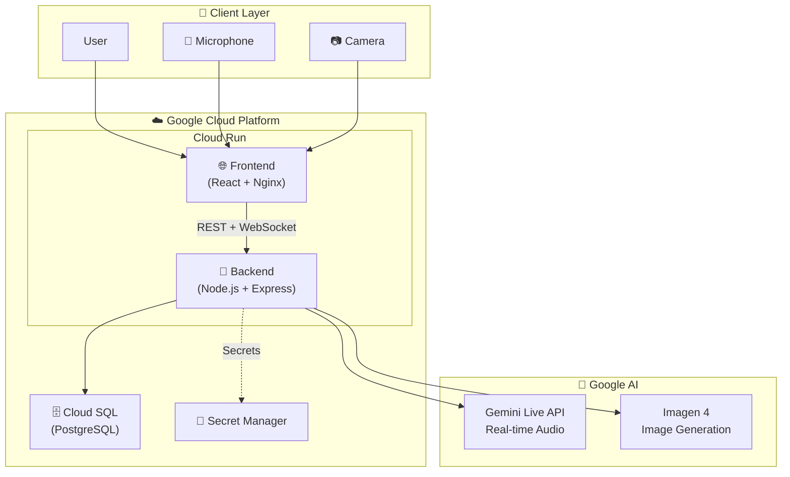
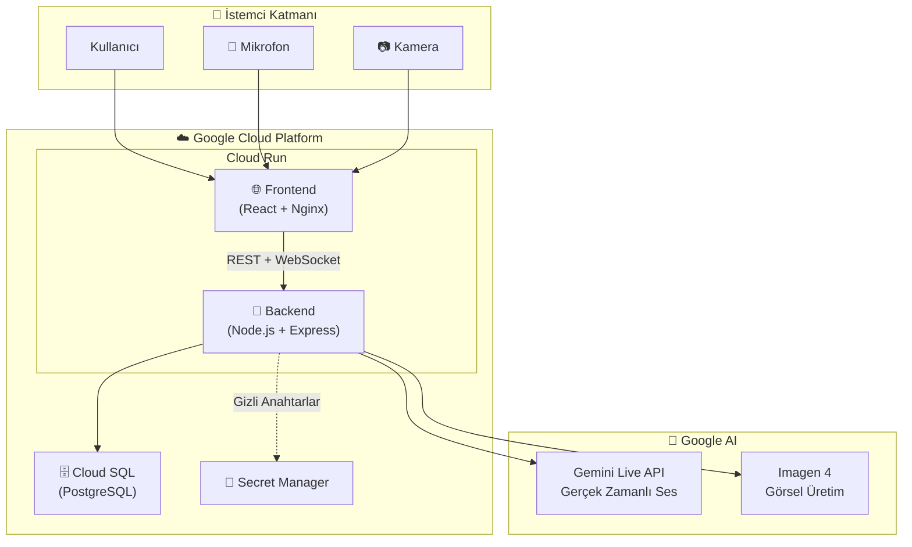

# Nöra - Cognitive Screening AI Assistant

> ** - Live Agents Category**
>
> Real-time voice-visual interactive pre-screening AI agent for Alzheimer's and cognitive decline risk.

**🌐 Language / Dil:** [English](#english) | [Türkçe](#türkçe)

---

<a name="english"></a>
  
## 📋 Competition Submission Links

| Submission | URL |
|---|---|
| **Public Repository** | https://github.com/knowhycodata/knowhy-nora |
| **Live Demo** | https://nora-frontend-806414321712.us-central1.run.app |
| **Demo Video** | *https://youtu.be/gtv1Bgd5Exc* | English Dubbed: https://youtu.be/m4iG0bB2zdI

---

## ✅ Competition Requirements Proof

### Mandatory Requirements

| # | Requirement | Status | Proof File |
|---|---|---|---|
| 1 | Gemini model usage | ✅ | [`packages/backend/package.json`](packages/backend/package.json) - `@google/genai` |
| 2 | GenAI SDK or ADK | ✅ | [`packages/backend/src/services/geminiLive.js`](packages/backend/src/services/geminiLive.js) |
| 3 | Live Agents (real-time audio/vision) | ✅ | [`packages/frontend/src/hooks/useGeminiLive.js`](packages/frontend/src/hooks/useGeminiLive.js) |
| 4 | Multimodal input/output | ✅ | Audio, text, image generation, camera analysis |
| 5 | At least one GCP service | ✅ | Cloud Run, Cloud SQL, Secret Manager |
| 6 | README spin-up instructions | ✅ | See "Quick Start" section below |
| 7 | Architecture Diagram | ✅ | See "Architecture" section below |
| 8 | Public Code Repository | ✅ | [GitHub Link](https://github.com/knowhycodata/knowhy-nora) |

### Bonus Requirements

| # | Bonus | Status | Proof |
|---|---|---|---|
| 1 | IaC / Automated Deployment | ✅ | [`deploy.sh`](deploy.sh) + [`deploy.ps1`](deploy.ps1) + [`cloudbuild.yaml`](cloudbuild.yaml) |
| 2 | Blog/Podcast/Video | ✅ | https://knowhyco.substack.com/p/when-we-forget-what-we-have-forgotten |
| 3 | GDG Membership | ✅ | https://gdg.community.dev/u/mc25pw |

---

## 🎯 Project Summary

Nöra provides a cognitive screening experience that progresses through natural conversation flow with the user:

- **Gemini Live API** for real-time voice conversation (interruptible)
- **Imagen 4** for image generation and recognition tests
- **Camera analysis** for focus, facial expression, and eye contact observations
- **Deterministic scoring** - LLM does not calculate; backend algorithms handle all scoring

### Features

| Feature | Description |
|---|---|
| 🎤 Live Voice Conversation | Low-latency streaming via AudioWorklet + WebSocket |
| 🖼️ Visual Test | Image generation with Imagen 4, recognition test |
| 📷 Camera Analysis | Real-time behavior/focus analysis |
| 📊 Results Screen | Test-based scores, risk status, PDF report |
| 🔐 Security | JWT auth, rate-limit, input validation |

---

## 🏗️ Architecture Diagram



<details>
<summary>Mermaid Source (click to expand)</summary>



</details>

---

## 📁 Project Structure

```text
gemini_challenge/
├── packages/
│   ├── frontend/          # React + Vite + TailwindCSS
│   └── backend/           # Node.js + Express + Prisma
├── deploy.sh/ps1          # ⭐ IaC: Automated GCP deploy script
├── cloudbuild.yaml        # ⭐ IaC: Cloud Build CI/CD pipeline
├── docker-compose.yml     # Local development
├── .env.example           # Environment variables template
└── README.md
```

---

## 🚀 Quick Start (Local)

### Prerequisites

| Requirement | Version |
|---|---|
| Node.js | 20+ |
| Docker & Docker Compose | Latest |
| Google Gemini API Key | - |

### Installation

```bash
# 1. Clone the repo
git clone https://github.com/knowhycodata/knowhy_gemini_live_agent_challange.git
cd knowhy_gemini_live_agent_challange

# 2. Set environment variables
cp .env.example .env
# Add your GOOGLE_API_KEY and JWT_SECRET to .env

# 3. Install dependencies and prepare database
npm install
npm run db:migrate
npm run db:seed

# 4. Start the application
npm run dev
```

### Alternative: Docker Compose

```bash
docker-compose up -d
```

### Local URLs

| Service | URL |
|---|---|
| Frontend | http://localhost:5173 |
| Backend | http://localhost:3001 |
| Health Check | http://localhost:3001/api/health |

### Demo Account

| Field | Value |
|---|---|
| Email | `demo@nora.ai` |
| Password | `demo123` |

---

## ☁️ Google Cloud Deploy

> **Competition Requirement:** Backend must run on Google Cloud.
>
> **Proof:** [Live Demo](https://nora-frontend-806414321712.us-central1.run.app) + [Backend Health](https://nora-backend-806414321712.us-central1.run.app/api/health)

### Method 1: Automated Deploy Script (⭐ Bonus: IaC)

**File:** [`deploy.sh/ps1`](deploy.sh/ps1)

Sets up entire GCP infrastructure with a single command:

```bash
# 1. Prerequisites
gcloud auth login

# 2. Set env vars
export GCP_PROJECT_ID="YOUR_PROJECT_ID"
export GCP_REGION="us-central1"
export GOOGLE_API_KEY="YOUR_GOOGLE_API_KEY"
export JWT_SECRET="YOUR_JWT_SECRET"
export DB_PASSWORD="STRONG_DB_PASSWORD"

# 3. Run deploy script
bash deploy.sh/ps1
```

The script automatically:
- Enables GCP APIs
- Creates Artifact Registry
- Sets up Cloud SQL (PostgreSQL 16)
- Writes secrets to Secret Manager
- Builds Backend and Frontend Docker images
- Deploys both services to Cloud Run
- Updates CORS settings
- Performs health check

### Method 2: Cloud Build CI/CD (⭐ Bonus: IaC)

**File:** [`cloudbuild.yaml`](cloudbuild.yaml)

CI/CD pipeline with automatic trigger from GitHub:

```bash
# Manual trigger
gcloud builds submit --config=cloudbuild.yaml .

# Or create trigger (after connecting GitHub repo)
gcloud builds triggers create github \
  --repo-name=YOUR_REPO \
  --repo-owner=YOUR_GITHUB_USER \
  --branch-pattern="^main$" \
  --build-config=cloudbuild.yaml
```

### Method 3: Manual Step-by-Step Deploy

<details>
<summary>Click to view manual steps</summary>

#### 6.1 GCP Setup

```bash
export PROJECT_ID="YOUR_PROJECT_ID"
export REGION="us-central1"
export REPO_NAME="nora-repo"

gcloud auth login
gcloud config set project $PROJECT_ID

gcloud services enable \
  run.googleapis.com \
  cloudbuild.googleapis.com \
  artifactregistry.googleapis.com \
  secretmanager.googleapis.com \
  sqladmin.googleapis.com
```

#### 6.2 Artifact Registry + Image Build

```bash
gcloud artifacts repositories create $REPO_NAME \
  --repository-format=docker \
  --location=$REGION

# Backend
gcloud builds submit ./packages/backend \
  --tag $REGION-docker.pkg.dev/$PROJECT_ID/$REPO_NAME/nora-backend:latest

# Frontend
gcloud builds submit ./packages/frontend \
  --tag $REGION-docker.pkg.dev/$PROJECT_ID/$REPO_NAME/nora-frontend:latest
```

#### 6.3 Cloud SQL (PostgreSQL) Setup

```bash
gcloud sql instances create nora-pg \
  --database-version=POSTGRES_16 \
  --tier=db-custom-1-3840 \
  --region=$REGION

gcloud sql databases create cognitive_agent --instance=nora-pg
gcloud sql users create nora_user --instance=nora-pg --password='CHANGE_ME_STRONG_PASSWORD'

CONNECTION_NAME=$(gcloud sql instances describe nora-pg --format='value(connectionName)')
```

#### 6.4 Secret Manager

```bash
echo -n 'YOUR_GOOGLE_API_KEY' | gcloud secrets create GOOGLE_API_KEY --data-file=-
echo -n 'YOUR_JWT_SECRET' | gcloud secrets create JWT_SECRET --data-file=-
echo -n 'YOUR_GOOGLE_API_KEY' | gcloud secrets create GEMINI_IMAGE_API_KEY --data-file=-
```

#### 6.5 Backend Cloud Run Deploy

```bash
gcloud run deploy nora-backend \
  --image $REGION-docker.pkg.dev/$PROJECT_ID/$REPO_NAME/nora-backend:latest \
  --region $REGION \
  --allow-unauthenticated \
  --add-cloudsql-instances $CONNECTION_NAME \
  --session-affinity \
  --timeout=3600 \
  --set-env-vars NODE_ENV=production,PORT=8080,GOOGLE_GENAI_USE_VERTEXAI=FALSE,GOOGLE_CLOUD_PROJECT=$PROJECT_ID,GOOGLE_CLOUD_PROJECT_ID=$PROJECT_ID,GOOGLE_CLOUD_LOCATION=$REGION,GEMINI_LIVE_MODEL=gemini-2.5-flash-native-audio-preview-12-2025,GEMINI_TEXT_MODEL=gemini-2.5-flash,GEMINI_IMAGE_MODEL=gemini-2.0-flash-preview-image-generation,GEMINI_STORY_MODEL=gemini-3.1-flash-lite-preview,IMAGEN_MODEL=imagen-4.0-fast-generate-001,DATABASE_URL=postgresql://nora_user:CHANGE_ME_STRONG_PASSWORD@/cognitive_agent?host=/cloudsql/$CONNECTION_NAME\&schema=public \
  --set-secrets GOOGLE_API_KEY=GOOGLE_API_KEY:latest,JWT_SECRET=JWT_SECRET:latest,GEMINI_IMAGE_API_KEY=GEMINI_IMAGE_API_KEY:latest
```

#### 6.6 Frontend Cloud Run Deploy

```bash
BACKEND_URL=$(gcloud run services describe nora-backend --region=$REGION --format='value(status.url)')

gcloud run deploy nora-frontend \
  --image $REGION-docker.pkg.dev/$PROJECT_ID/$REPO_NAME/nora-frontend:latest \
  --region $REGION \
  --allow-unauthenticated \
  --port=80 \
  --set-env-vars "BACKEND_URL=$BACKEND_URL"
```

#### 6.7 CORS Update

```bash
FRONTEND_URL=$(gcloud run services describe nora-frontend --region=$REGION --format='value(status.url)')
gcloud run services update nora-backend --region $REGION --update-env-vars "FRONTEND_URL=$FRONTEND_URL"
```

</details>

### Deployed Services

| Service | URL | Status |
|---|---|---|
| **Frontend** | https://nora-frontend-806414321712.us-central1.run.app | ✅ Active |
| **Backend** | https://nora-backend-806414321712.us-central1.run.app | ✅ Active |
| **Health Check** | https://nora-backend-806414321712.us-central1.run.app/api/health | ✅ 200 OK |

---

## � Findings & Learnings

### Technical Challenges

1. **LLM Hallucination in Scoring**: Early experiments showed that Gemini would sometimes miscalculate test scores or invent metrics. We solved this by implementing **deterministic scoring** — the AI agent only collects data via tool calling, and all calculations happen algorithmically in the backend. This was the single most important architectural decision.

2. **WebSocket Proxy Architecture**: Gemini Live API requires a persistent bidirectional connection. Browsers cannot directly connect to Gemini's WebSocket endpoint due to CORS and authentication constraints. We built a **Node.js WebSocket proxy** that maintains the Gemini session server-side while streaming audio to/from the client via a separate WebSocket channel.

3. **Audio Pipeline Complexity**: Real-time audio streaming required careful handling of PCM encoding, sample rates, and buffer sizes. We used **AudioWorklet** (not the deprecated ScriptProcessorNode) for low-latency audio capture and playback, which significantly reduced audio glitches.

4. **Multi-Agent Coordination**: Managing 5 concurrent agents (Nöra, BrainAgent, VisualTestAgent, DateTimeAgent, VideoAnalysisAgent + CameraPresenceAgent) required careful state synchronization. We solved race conditions by implementing a centralized state machine in BrainAgent that coordinates test transitions.

5. **Timer Management**: LLMs have no reliable sense of time. Letting the AI manage test timers resulted in inconsistent durations. We moved timer logic entirely to BrainAgent with server-side `setTimeout`, injecting timer events as text messages into the Live API session.

6. **Dynamic Content Generation**: Static test content (stories, images) would allow memorization. We integrated **Gemini 3.1 Flash Lite** for real-time story generation and **Imagen 4** for dynamic image generation, ensuring each session is unique.

### Key Learnings

- **Gemini Live API** is remarkably capable for natural, interruptible voice conversations — but it requires explicit, detailed system instructions to maintain consistent behavior across long sessions.
- **Tool Calling** with Live API works well but requires sanitization of responses to prevent session instability from malformed JSON.
- **Cloud Run session affinity** is essential for WebSocket-based applications — without it, connections get routed to different instances and break.
- **Multi-language support** in voice agents requires careful prompt engineering — the agent's language behavior must be anchored in the system instruction, not left to inference.

---

## � Security & Design Decisions

| Decision | Description |
|---|---|
| **Deterministic Scoring** | LLM does not calculate scores; all scores are computed algorithmically in backend |
| **JWT Authentication** | Token-based auth with rate limiting |
| **Input Validation** | All inputs validated with express-validator |
| **Tool Calling Sanitization** | Tool call results sanitized for live session stability |

---

## 📄 License

This project was developed for ****.

---

---

<a name="türkçe"></a>

# Nöra - Bilişsel Tarama AI Asistanı

> ** - Live Agents Kategorisi**
>
> Alzheimer ve bilişsel bozulma riski için gerçek zamanlı sesli-görsel etkileşimli ön tarama AI ajanı.

---

## 📋 Yarışma Teslim Linkleri

| Teslim | URL |
|---|---|
| **Public Repository** | https://github.com/knowhycodata/knowhy-nora |
| **Live Demo** | https://nora-frontend-806414321712.us-central1.run.app |
| **Demo Video (<4 dk)** | **https://youtu.be/gtv1Bgd5Exc* | İngilizce Dublaj: https://youtu.be/m4iG0bB2zdI

---

## ✅ Yarışma Şartları Kanıtı

### Zorunlu Gereksinimler

| # | Gereksinim | Durum | Kanıt Dosyası |
|---|---|---|---|
| 1 | Gemini modeli kullanımı | ✅ | [`packages/backend/package.json`](packages/backend/package.json) - `@google/genai` |
| 2 | GenAI SDK veya ADK | ✅ | [`packages/backend/src/services/geminiLive.js`](packages/backend/src/services/geminiLive.js) |
| 3 | Live Agents (real-time audio/vision) | ✅ | [`packages/frontend/src/hooks/useGeminiLive.js`](packages/frontend/src/hooks/useGeminiLive.js) |
| 4 | Multimodal giriş/çıkış | ✅ | Ses, metin, görsel üretim, kamera analizi |
| 5 | En az bir GCP servisi | ✅ | Cloud Run, Cloud SQL, Secret Manager |
| 6 | README spin-up instructions | ✅ | Aşağıda "Hızlı Başlangıç" bölümü |
| 7 | Architecture Diagram | ✅ | Aşağıda "Architecture" bölümü |
| 8 | Public Code Repository | ✅ | [GitHub Link](https://github.com/knowhycodata/knowhy-nora) |

### Bonus Gereksinimler

| # | Bonus | Durum | Kanıt |
|---|---|---|---|
| 1 | IaC / Automated Deployment | ✅ | [`deploy.sh`](deploy.sh) + [`deploy.ps1`](deploy.ps1) + [`cloudbuild.yaml`](cloudbuild.yaml) |
| 2 | Blog/Podcast/Video | ✅ | https://knowhyco.substack.com/p/when-we-forget-what-we-have-forgotten |
| 3 | GDG Üyeliği | ✅ | https://gdg.community.dev/u/mc25pw |

---

## 🎯 Proje Özeti

Nöra, kullanıcı ile doğal konuşma akışında ilerleyen bir bilişsel tarama deneyimi sunar:

- **Gemini Live API** ile gerçek zamanlı sesli konuşma (kesintiye dayanıklı)
- **Imagen 4** ile görsel üretim ve tanıma testleri
- **Kamera analizi** ile odak, mimik, göz teması gözlemleri
- **Deterministik skorlama** - LLM hesaplamaz, backend algoritmaları hesaplar

### Özellikler

| Özellik | Açıklama |
|---|---|
| 🎤 Canlı Sesli Konuşma | AudioWorklet + WebSocket ile düşük gecikmeli akış |
| 🖼️ Görsel Test | Imagen 4 ile görsel üretim, tanıma testi |
| 📷 Kamera Analizi | Gerçek zamanlı davranış/odak analizi |
| 📊 Sonuç Ekranı | Test bazlı skorlar, risk durumu, PDF rapor |
| 🔐 Güvenlik | JWT auth, rate-limit, input validation |

---

## 🏗️ Mimari Diyagramı


<details>
<summary>Mermaid Kaynak Kodu (görmek için tıklayın)</summary>



</details>

---

## 📁 Proje Yapısı

```text
gemini_challenge/
├── packages/
│   ├── frontend/          # React + Vite + TailwindCSS
│   └── backend/           # Node.js + Express + Prisma
├── deploy.sh/ps1          # ⭐ IaC: Otomatik GCP deploy scripti
├── cloudbuild.yaml        # ⭐ IaC: Cloud Build CI/CD pipeline
├── docker-compose.yml     # Lokal geliştirme
├── .env.example           # Environment variables şablonu
└── README.md
```

---

## 🚀 Hızlı Başlangıç (Lokal)

### Ön Gereksinimler

| Gereksinim | Versiyon |
|---|---|
| Node.js | 20+ |
| Docker & Docker Compose | Latest |
| Google Gemini API Key | - |

### Kurulum

```bash
# 1. Repo'yu klonla
git clone https://github.com/knowhycodata/knowhy_gemini_live_agent_challange.git
cd knowhy_gemini_live_agent_challange

# 2. Environment variables ayarla
cp .env.example .env
# .env içine GOOGLE_API_KEY ve JWT_SECRET girin

# 3. Bağımlılıkları kur ve veritabanını hazırla
npm install
npm run db:migrate
npm run db:seed

# 4. Uygulamayı başlat
npm run dev
```

### Alternatif: Docker Compose

```bash
docker-compose up -d
```

### Lokal URL'ler

| Servis | URL |
|---|---|
| Frontend | http://localhost:5173 |
| Backend | http://localhost:3001 |
| Health Check | http://localhost:3001/api/health |

### Demo Hesap

| Alan | Değer |
|---|---|
| E-posta | `demo@nora.ai` |
| Şifre | `demo123` |

---

## ☁️ Google Cloud Deploy

> **Yarışma Şartı:** Backend Google Cloud üzerinde çalışmalıdır.
>
> **Kanıt:** [Live Demo](https://nora-frontend-806414321712.us-central1.run.app) + [Backend Health](https://nora-backend-806414321712.us-central1.run.app/api/health)

### Yöntem 1: Otomatik Deploy Script (⭐ Bonus: IaC)

**Dosya:** [`deploy.sh/ps1`](deploy.sh/ps1)

Tek komutla tüm GCP altyapısını kurar:

```bash
# 1. Ön gereksinimler
gcloud auth login

# 2. Env vars ayarla
export GCP_PROJECT_ID="YOUR_PROJECT_ID"
export GCP_REGION="us-central1"
export GOOGLE_API_KEY="YOUR_GOOGLE_API_KEY"
export JWT_SECRET="YOUR_JWT_SECRET"
export DB_PASSWORD="STRONG_DB_PASSWORD"

# 3. Deploy scriptini çalıştır
bash deploy.sh/ps1
```

Script şunları otomatik yapar:
- GCP API'lerini etkinleştirir
- Artifact Registry oluşturur
- Cloud SQL (PostgreSQL 16) kurar
- Secret Manager'a anahtarları yazar
- Backend ve Frontend Docker image'lerini build eder
- Her iki servisi Cloud Run'a deploy eder
- CORS ayarlarını günceller
- Health check yapar

### Yöntem 2: Cloud Build CI/CD (⭐ Bonus: IaC)

**Dosya:** [`cloudbuild.yaml`](cloudbuild.yaml)

GitHub'dan otomatik trigger ile CI/CD pipeline:

```bash
# Manuel tetikleme
gcloud builds submit --config=cloudbuild.yaml .

# Veya trigger oluşturma (GitHub repo bağlandıktan sonra)
gcloud builds triggers create github \
  --repo-name=YOUR_REPO \
  --repo-owner=YOUR_GITHUB_USER \
  --branch-pattern="^main$" \
  --build-config=cloudbuild.yaml
```

### Yöntem 3: Manuel Adım Adım Deploy

<details>
<summary>Manuel adımları görmek için tıklayın</summary>

#### 6.1 GCP Hazırlık

```bash
export PROJECT_ID="YOUR_PROJECT_ID"
export REGION="us-central1"
export REPO_NAME="nora-repo"

gcloud auth login
gcloud config set project $PROJECT_ID

gcloud services enable \
  run.googleapis.com \
  cloudbuild.googleapis.com \
  artifactregistry.googleapis.com \
  secretmanager.googleapis.com \
  sqladmin.googleapis.com
```

#### 6.2 Artifact Registry + Image Build

```bash
gcloud artifacts repositories create $REPO_NAME \
  --repository-format=docker \
  --location=$REGION

# Backend
gcloud builds submit ./packages/backend \
  --tag $REGION-docker.pkg.dev/$PROJECT_ID/$REPO_NAME/nora-backend:latest

# Frontend
gcloud builds submit ./packages/frontend \
  --tag $REGION-docker.pkg.dev/$PROJECT_ID/$REPO_NAME/nora-frontend:latest
```

#### 6.3 Cloud SQL (PostgreSQL) Oluşturma

```bash
gcloud sql instances create nora-pg \
  --database-version=POSTGRES_16 \
  --tier=db-custom-1-3840 \
  --region=$REGION

gcloud sql databases create cognitive_agent --instance=nora-pg
gcloud sql users create nora_user --instance=nora-pg --password='CHANGE_ME_STRONG_PASSWORD'

CONNECTION_NAME=$(gcloud sql instances describe nora-pg --format='value(connectionName)')
```

#### 6.4 Secret Manager

```bash
echo -n 'YOUR_GOOGLE_API_KEY' | gcloud secrets create GOOGLE_API_KEY --data-file=-
echo -n 'YOUR_JWT_SECRET' | gcloud secrets create JWT_SECRET --data-file=-
echo -n 'YOUR_GOOGLE_API_KEY' | gcloud secrets create GEMINI_IMAGE_API_KEY --data-file=-
```

#### 6.5 Backend Cloud Run Deploy

```bash
gcloud run deploy nora-backend \
  --image $REGION-docker.pkg.dev/$PROJECT_ID/$REPO_NAME/nora-backend:latest \
  --region $REGION \
  --allow-unauthenticated \
  --add-cloudsql-instances $CONNECTION_NAME \
  --session-affinity \
  --timeout=3600 \
  --set-env-vars NODE_ENV=production,PORT=8080,GOOGLE_GENAI_USE_VERTEXAI=FALSE,GOOGLE_CLOUD_PROJECT=$PROJECT_ID,GOOGLE_CLOUD_PROJECT_ID=$PROJECT_ID,GOOGLE_CLOUD_LOCATION=$REGION,GEMINI_LIVE_MODEL=gemini-2.5-flash-native-audio-preview-12-2025,GEMINI_TEXT_MODEL=gemini-2.5-flash,GEMINI_IMAGE_MODEL=gemini-2.0-flash-preview-image-generation,GEMINI_STORY_MODEL=gemini-3.1-flash-lite-preview,IMAGEN_MODEL=imagen-4.0-fast-generate-001,DATABASE_URL=postgresql://nora_user:CHANGE_ME_STRONG_PASSWORD@/cognitive_agent?host=/cloudsql/$CONNECTION_NAME\&schema=public \
  --set-secrets GOOGLE_API_KEY=GOOGLE_API_KEY:latest,JWT_SECRET=JWT_SECRET:latest,GEMINI_IMAGE_API_KEY=GEMINI_IMAGE_API_KEY:latest
```

#### 6.6 Frontend Cloud Run Deploy

```bash
BACKEND_URL=$(gcloud run services describe nora-backend --region=$REGION --format='value(status.url)')

gcloud run deploy nora-frontend \
  --image $REGION-docker.pkg.dev/$PROJECT_ID/$REPO_NAME/nora-frontend:latest \
  --region $REGION \
  --allow-unauthenticated \
  --port=80 \
  --set-env-vars "BACKEND_URL=$BACKEND_URL"
```

#### 6.7 CORS Güncelle

```bash
FRONTEND_URL=$(gcloud run services describe nora-frontend --region=$REGION --format='value(status.url)')
gcloud run services update nora-backend --region $REGION --update-env-vars "FRONTEND_URL=$FRONTEND_URL"
```

</details>

### Deploy Edilmiş Servisler

| Servis | URL | Durum |
|---|---|---|
| **Frontend** | https://nora-frontend-806414321712.us-central1.run.app | ✅ Aktif |
| **Backend** | https://nora-backend-806414321712.us-central1.run.app | ✅ Aktif |
| **Health Check** | https://nora-backend-806414321712.us-central1.run.app/api/health | ✅ 200 OK |

---

## 💡 Bulgular ve Öğrenilenler

### Teknik Zorluklar

1. **LLM Halüsinasyonu ve Skorlama**: İlk denemelerde Gemini'nin test puanlarını yanlış hesapladığını veya olmayan metrikler uydurduğunu gözlemledik. Bunu **deterministik skorlama** ile çözdük — AI ajan yalnızca tool calling ile veri toplar, tüm hesaplamalar backend'de algoritmik olarak yapılır. Bu, en kritik mimari kararımız oldu.

2. **WebSocket Proxy Mimarisi**: Gemini Live API kalıcı çift yönlü bağlantı gerektirir. Tarayıcılar CORS ve kimlik doğrulama kısıtlamaları nedeniyle Gemini'nin WebSocket endpoint'ine doğrudan bağlanamaz. Sunucu tarafında Gemini oturumunu yöneten bir **Node.js WebSocket proxy** inşa ettik.

3. **Ses Pipeline Karmaşıklığı**: Gerçek zamanlı ses akışı; PCM kodlama, örnekleme hızları ve buffer boyutlarının dikkatli yönetimini gerektirdi. Düşük gecikmeli ses yakalama ve çalma için **AudioWorklet** kullandık (kullanımdan kaldırılan ScriptProcessorNode yerine), bu da ses aksaklıklarını önemli ölçüde azalttı.

4. **Multi-Agent Koordinasyonu**: 5 eşzamanlı ajanı (Nöra, BrainAgent, VisualTestAgent, DateTimeAgent, VideoAnalysisAgent + CameraPresenceAgent) yönetmek dikkatli durum senkronizasyonu gerektirdi. Yarış koşullarını BrainAgent'ta merkezi bir durum makinesi uygulayarak çözdük.

5. **Zamanlayıcı Yönetimi**: LLM'lerin güvenilir bir zaman algısı yoktur. AI'ya test zamanlayıcılarını yönettirmek tutarsız sürelere yol açtı. Zamanlayıcı mantığını tamamen BrainAgent'a taşıdık ve sunucu tarafı `setTimeout` ile yönettik; zamanlayıcı olaylarını Live API oturumuna metin mesajları olarak enjekte ettik.

6. **Dinamik İçerik Üretimi**: Statik test içeriği (hikayeler, görseller) ezberlemeye olanak tanırdı. Gerçek zamanlı hikaye üretimi için **Gemini 3.1 Flash Lite**, dinamik görsel üretimi için **Imagen 4** entegre ettik; böylece her oturum benzersiz oldu.

### Temel Öğrenimler

- **Gemini Live API** doğal, kesintiye dayanıklı sesli konuşmalar için oldukça yetenekli — ancak uzun oturumlarda tutarlı davranış için açık ve detaylı system instruction gerektirir.
- **Tool Calling** Live API ile iyi çalışır ancak hatalı JSON'dan kaynaklanan oturum kararsızlığını önlemek için yanıt sanitizasyonu gerektirir.
- **Cloud Run session affinity** WebSocket tabanlı uygulamalar için zorunludur — aksi halde bağlantılar farklı instance'lara yönlendirilir ve kopar.
- **Çok dilli destek** sesli ajanlarda dikkatli prompt mühendisliği gerektirir — ajanın dil davranışı system instruction'da sabitlenmeli, çıkarıma bırakılmamalıdır.

---

## 🔐 Güvenlik ve Tasarım Kararları

| Karar | Açıklama |
|---|---|
| **Deterministik Skorlama** | LLM skor hesaplamaz; tüm puanlar backend'de algoritmik olarak hesaplanır |
| **JWT Authentication** | Token-based auth, rate limiting uygulanır |
| **Input Validation** | express-validator ile tüm girdiler doğrulanır |
| **Tool Calling Sanitization** | Live session stabilitesi için araç çağrısı sonuçları sanitize edilir |

---

## 📄 Lisans

Bu proje **** için geliştirilmiştir.
