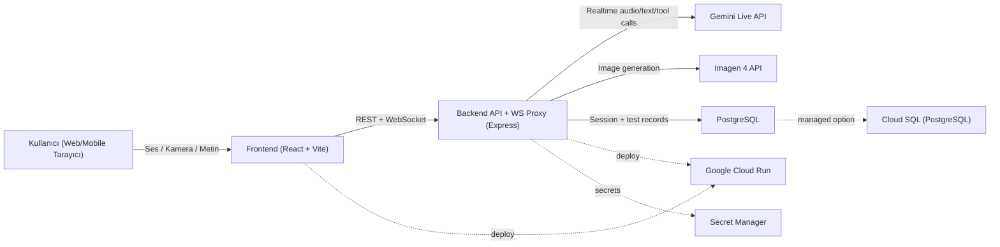

# Nöra - Bilişsel Tarama AI Asistanı

Alzheimer ve bilişsel bozulma riski için ön tarama yapan, gerçek zamanlı sesli-görsel etkileşimli AI ajanı.

**Kategori:** Gemini Hackathon - **Live Agents**

## 1. Proje Özeti (Text Description)

Nöra, kullanıcı ile doğal konuşma akışında ilerleyen bir bilişsel tarama deneyimi sunar. Sistem:

- Gemini Live API ile gerçek zamanlı konuşur (ses alır, sesli yanıt verir, transcript üretir).
- Test akışında görsel üretim (Imagen 4) kullanır.
- Kamera frame'lerini analiz ederek odak, mimik, göz teması gibi gözlemler toplar.
- Nihai puanlamayı deterministik backend algoritmalarıyla yapar (LLM'e bırakmaz).

### Özellikler

- Canlı sesli konuşma ve kesintiye dayanıklı etkileşim
- 4 adımlı bilişsel test akışı
- Görsel üretim + görsel tanıma testi
- Kamera tabanlı davranış/odak analizi
- Sonuç ekranı ve test bazlı skorlar

### Kullanılan Teknolojiler

| Katman | Teknoloji |
|---|---|
| Frontend | React, Vite, TailwindCSS |
| Backend | Node.js, Express, Prisma |
| Veritabanı | PostgreSQL |
| AI | Gemini Live API, Google GenAI SDK, Imagen 4 |
| Dağıtım | Docker, Google Cloud Run |

### Veri Kaynakları

- Kullanıcının canlı ses girdisi (mikrofon)
- Kullanıcının canlı kamera frame'leri (yalnızca test analizi için)
- Uygulama içi statik/fallback görseller
- Harici üçüncü parti dataset kullanılmaz

### Bulgular ve Öğrenimler

- Gerçek zamanlı voice UX için düşük gecikme kritik (AudioWorklet + websocket akışı tercih edildi).
- Multimodal ajanlarda araç çağrısı sonuçlarını sanitize etmek oturum stabilitesi için önemli.
- Skorlama mantığını backend'de deterministik tutmak, tutarlılık ve izlenebilirlik sağlar.

## 2. Yarışma Şartları Eşleştirmesi

| Şart | Durum | Kanıt |
|---|---|---|
| Gemini modeli kullanımı | Karşılanıyor | `@google/genai` bağımlılığı (`packages/backend/package.json`) |
| GenAI SDK veya ADK | Karşılanıyor | Google GenAI SDK kullanımı (`packages/backend/src/services/geminiLive.js`) |
| Live Agents (real-time audio/vision) | Karşılanıyor | Live websocket oturumu + audio/camera akışı (`packages/backend/src/index.js`, `packages/frontend/src/hooks/useGeminiLive.js`) |
| Multimodal giriş/çıkış | Karşılanıyor | Ses, metin, görsel üretim, kamera analizi |
| En az bir GCP servisi | Dağıtımda karşılanacak | Cloud Run (zorunlu dağıtım adımları aşağıda) |
| README spin-up instructions | Karşılanıyor | Bu dosyadaki "Hızlı Başlangıç" ve "GCP Deploy" bölümleri |

## 3. Architecture Diagram



## 4. Proje Yapısı

```text
gemini_challenge/
├── packages/
│   ├── frontend/
│   └── backend/
├── docker-compose.yml
├── .env.example
└── README.md
```

## 5. Hızlı Başlangıç (Lokal)

### Ön Gereksinimler

- Node.js 20+
- Docker & Docker Compose
- Google Gemini API Key

### Kurulum

```bash
# proje kökü
cp .env.example .env
# .env içine GOOGLE_API_KEY ve JWT_SECRET girin

npm install
npm run db:migrate
npm run db:seed
npm run dev
```

Alternatif:

```bash
docker-compose up -d
```

### Lokal URL'ler

- Frontend: `http://localhost:5173`
- Backend: `http://localhost:3001`
- Health: `http://localhost:3001/api/health`

### Demo Hesap

- E-posta: `demo@nora.ai`
- Şifre: `demo123`

## 6. Google Cloud Deploy (Backend Proof İçin Önerilen Akış)

Bu bölüm, yarışmanın "Google Cloud deployment proof" kriterini karşılamak için doğrudan uygulanabilir bir akıştır.

### 6.1 GCP Hazırlık

```bash
export PROJECT_ID="YOUR_PROJECT_ID"
export REGION="us-central1"
export REPO_NAME="nora-repo"
export IMAGE_NAME="nora-backend"
export SERVICE_NAME="nora-backend"

gcloud auth login
gcloud config set project $PROJECT_ID

gcloud services enable \
  run.googleapis.com \
  cloudbuild.googleapis.com \
  artifactregistry.googleapis.com \
  secretmanager.googleapis.com \
  sqladmin.googleapis.com
```

### 6.2 Artifact Registry + Image Build

```bash
gcloud artifacts repositories create $REPO_NAME \
  --repository-format=docker \
  --location=$REGION

gcloud builds submit ./packages/backend \
  --tag $REGION-docker.pkg.dev/$PROJECT_ID/$REPO_NAME/$IMAGE_NAME:latest
```

### 6.3 Cloud SQL (PostgreSQL) Oluşturma

```bash
gcloud sql instances create nora-pg \
  --database-version=POSTGRES_16 \
  --tier=db-custom-1-3840 \
  --region=$REGION

gcloud sql databases create cognitive_agent --instance=nora-pg
gcloud sql users create nora_user --instance=nora-pg --password='CHANGE_ME_STRONG_PASSWORD'

CONNECTION_NAME=$(gcloud sql instances describe nora-pg --format='value(connectionName)')
```

### 6.4 Secret Manager

```bash
echo -n 'YOUR_GOOGLE_API_KEY' | gcloud secrets create GOOGLE_API_KEY --data-file=-
echo -n 'YOUR_JWT_SECRET' | gcloud secrets create JWT_SECRET --data-file=-
echo -n 'YOUR_GOOGLE_API_KEY' | gcloud secrets create GEMINI_IMAGE_API_KEY --data-file=-
```

### 6.5 Cloud Run Deploy

```bash
gcloud run deploy $SERVICE_NAME \
  --image $REGION-docker.pkg.dev/$PROJECT_ID/$REPO_NAME/$IMAGE_NAME:latest \
  --region $REGION \
  --allow-unauthenticated \
  --add-cloudsql-instances $CONNECTION_NAME \
  --set-env-vars NODE_ENV=production,PORT=8080,GOOGLE_GENAI_USE_VERTEXAI=FALSE,GOOGLE_CLOUD_PROJECT=$PROJECT_ID,GOOGLE_CLOUD_PROJECT_ID=$PROJECT_ID,GOOGLE_CLOUD_LOCATION=$REGION,GEMINI_LIVE_MODEL=gemini-2.5-flash-native-audio-preview-12-2025,GEMINI_TEXT_MODEL=gemini-2.5-flash,GEMINI_IMAGE_MODEL=gemini-2.0-flash-preview-image-generation,GEMINI_STORY_MODEL=gemini-3.1-flash-lite-preview,IMAGEN_MODEL=imagen-4.0-fast-generate-001,DATABASE_URL=postgresql://nora_user:CHANGE_ME_STRONG_PASSWORD@/cognitive_agent?host=/cloudsql/$CONNECTION_NAME\&schema=public \
  --set-secrets GOOGLE_API_KEY=GOOGLE_API_KEY:latest,JWT_SECRET=JWT_SECRET:latest,GEMINI_IMAGE_API_KEY=GEMINI_IMAGE_API_KEY:latest
```

Deploy sonrası health kontrolü:

```bash
SERVICE_URL=$(gcloud run services describe $SERVICE_NAME --region=$REGION --format='value(status.url)')
curl "$SERVICE_URL/api/health"
```

## 7. Google Cloud Deployment Proof (Yarışma Teslimi)

Yarışma şartı: backend'in Google Cloud üzerinde çalıştığını kanıtlamalısınız.

### Önerilen Proof İçeriği (1-2 dakikalık kısa kayıt)

1. Cloud Run service listesinde `nora-backend` servisinin göründüğünü gösterin.
2. Service detayında son revision ve URL'yi gösterin.
3. Cloud Logging ekranında backend loglarını canlı gösterin.
4. Tarayıcı veya terminalden `GET /api/health` çağrısının `200` döndüğünü gösterin.
5. (Opsiyonel ama güçlü kanıt) Cloud SQL instance + bağlantı konfigürasyonunu gösterin.

### README'de Bulunması Gereken Teslim Linkleri

- Public repo URL: `PASTE_PUBLIC_REPO_URL`
- Demo video (<4 dk): `PASTE_DEMO_VIDEO_URL`
- Google Cloud proof video: `PASTE_GCP_PROOF_VIDEO_URL`

## 8. Demonstration Video Checklist (< 4 dakika)

- Gerçek zamanlı sesli etkileşimi canlı gösterin (mockup değil).
- Görsel üretim ve kamera analizi akışını canlı gösterin.
- Çözdüğünüz problemi ve ürün değerini kısa, net anlatın.

## 9. Güvenlik ve Mimari Notlar

- LLM skor hesaplamaz; skorlar backend'de deterministik hesaplanır.
- JWT auth, rate-limit, helmet, input validation uygulanır.
- Tool calling sonuçları sanitize edilerek Live session stabilitesi korunur.

## 10. Lisans

Bu proje Gemini Hackathon için geliştirilmiştir.
